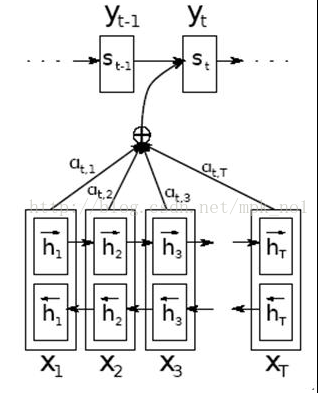
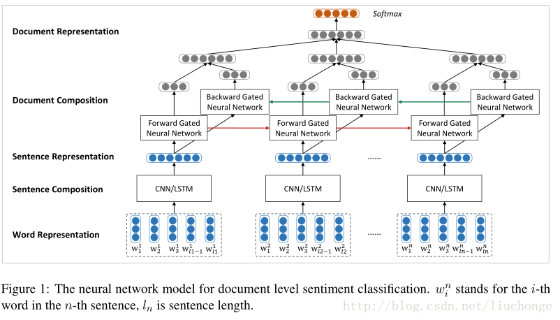
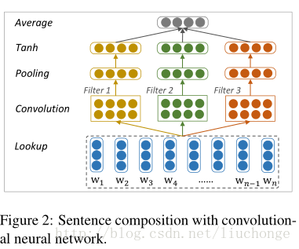
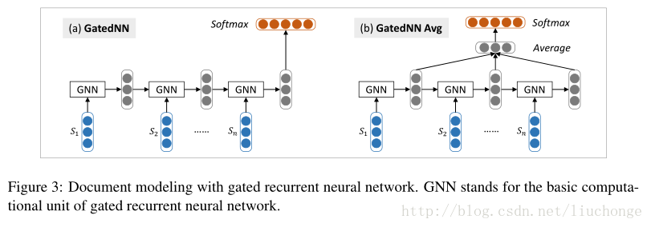

## Attention

#### 1、Attention 提出
在Seq2Seq模型中，编码器将完整的输入句子压缩到一个维度固定的向量中。然后解码器根据这个向量生成输出句子。然而，当输入句子比较长时，这个中间向量难以存储足够的信息，就成为这个模型的一个瓶颈。注意力("Attention")机制就是为了解决这个问题设计的。注意力机制允许解码器随时查询输入句子中的部分单词或者片段，因此不再需要在中间向量中存储所有信息。下图展示了使用了注意力机制的Seq2Seq模型。

下面介绍注意力机制的数学定义。在上图中，$h_i$表示编码器在第$i$个单词上的输出，$s_j$是编码器在预测第$j$个单词时的状态。计算$j$时刻的context的方法为：
$$ \alpha_{i,j}=\frac{\exp{(e(h_i,s_j))}}{\sum_i \exp{e(h_i,s_j)}} $$
$$ context_j=\sum_i {\alpha_{i,j}h_i} $$
其中$e(h_i,s_j)$是计算原文各单词与当前解码器状态的“相关度”的函数，最常用的$e(h_i,s_j)$函数定义是一个带有单个隐藏层的前馈神经网络：
$$e(h,s)=Utanh(Vh+Ws)$$
其中U,V,W是模型参数，$e(h_i,s_j)$构成了一个包含隐藏层的全连接神经网络。这个模型是$Dzmitry Bahdanau$等第一次提出的，因此称之为[Bahdanau Attention](https://arxiv.org/pdf/1409.0473)模型

除此之外，注意力机制还有很多其他设计，如$Minh-Thang Luong$等提出的$e(h,s)=h^T W s$，或者直接使用两个状态点乘$e(h,s)=h^Ts$。接下来就通过$softmax$计算权重$\alpha$和加权值$contex$的值。

在计算得到第$j$步的$context_j$之后，$contex$被加入到$j+1$时刻作为循环层的输入。假设$h$的维度是$hidden\_src$，词向量的维度是$hidden\_emb$，那么在计算隐藏状态$s_j$时，输入的维度是$hidden\_src+hidden\_emb$。通过$contex$向量，解码器可以在解码的每一步查询最相关的原文信息，从而避免Seq2Seq模型中信息瓶颈问题。

#### 2、基于tensorflow定义NMTModel类来描述模型


```python
class NMTModel(object):
    # 在模型的初始化函数中定义模型要用到的变量。
    def __init__(self):
        # 定义编码器和解码器所使用的LSTM结构。
        self.enc_cell_fw = tf.nn.rnn_cell.BasicLSTMCell(HIDDEN_SIZE)
        self.enc_cell_bw = tf.nn.rnn_cell.BasicLSTMCell(HIDDEN_SIZE)
        self.dec_cell = tf.nn.rnn_cell.MultiRNNCell(
          [tf.nn.rnn_cell.BasicLSTMCell(HIDDEN_SIZE) 
           for _ in range(DECODER_LAYERS)])

        # 为源语言和目标语言分别定义词向量。   
        self.src_embedding = tf.get_variable(
            "src_emb", [SRC_VOCAB_SIZE, HIDDEN_SIZE])
        self.trg_embedding = tf.get_variable(
            "trg_emb", [TRG_VOCAB_SIZE, HIDDEN_SIZE])

        # 定义softmax层的变量
        if SHARE_EMB_AND_SOFTMAX:
           self.softmax_weight = tf.transpose(self.trg_embedding)
        else:
           self.softmax_weight = tf.get_variable(
               "weight", [HIDDEN_SIZE, TRG_VOCAB_SIZE])
        self.softmax_bias = tf.get_variable(
            "softmax_bias", [TRG_VOCAB_SIZE])

    # 在forward函数中定义模型的前向计算图。
    # src_input, src_size, trg_input, trg_label, trg_size分别是上面
    # MakeSrcTrgDataset函数产生的五种张量。
    def forward(self, src_input, src_size, trg_input, trg_label, trg_size):
        batch_size = tf.shape(src_input)[0]
    
        # 将输入和输出单词编号转为词向量。
        src_emb = tf.nn.embedding_lookup(self.src_embedding, src_input)
        trg_emb = tf.nn.embedding_lookup(self.trg_embedding, trg_input)
        
        # 在词向量上进行dropout。
        src_emb = tf.nn.dropout(src_emb, KEEP_PROB)
        trg_emb = tf.nn.dropout(trg_emb, KEEP_PROB)

        # 使用dynamic_rnn构造编码器。
        # 编码器读取源句子每个位置的词向量，输出最后一步的隐藏状态enc_state。
        # 因为编码器是一个双层LSTM，因此enc_state是一个包含两个LSTMStateTuple类
        # 张量的tuple，每个LSTMStateTuple对应编码器中的一层。
        # 张量的维度是 [batch_size, HIDDEN_SIZE]。
        # enc_outputs是顶层LSTM在每一步的输出，它的维度是[batch_size, 
        # max_time, HIDDEN_SIZE]。Seq2Seq模型中不需要用到enc_outputs，而
        # 后面介绍的attention模型会用到它。
        # 下面的代码取代了Seq2Seq样例代码中forward函数里的相应部分。
        with tf.variable_scope("encoder"):
            # 构造编码器时，使用bidirectional_dynamic_rnn构造双向循环网络。
            # 双向循环网络的顶层输出enc_outputs是一个包含两个张量的tuple，每个张量的
            # 维度都是[batch_size, max_time, HIDDEN_SIZE]，代表两个LSTM在每一步的输出。
            enc_outputs, enc_state = tf.nn.bidirectional_dynamic_rnn(
                self.enc_cell_fw, self.enc_cell_bw, src_emb, src_size, 
                dtype=tf.float32)
            # 将两个LSTM的输出拼接为一个张量。
            enc_outputs = tf.concat([enc_outputs[0], enc_outputs[1]], -1)     

        with tf.variable_scope("decoder"):
            # 选择注意力权重的计算模型。BahdanauAttention是使用一个隐藏层的前馈神经网络。
            # memory_sequence_length是一个维度为[batch_size]的张量，代表batch
            # 中每个句子的长度，Attention需要根据这个信息把填充位置的注意力权重设置为0。
            attention_mechanism = tf.contrib.seq2seq.BahdanauAttention(
                HIDDEN_SIZE, enc_outputs,
                memory_sequence_length=src_size)

            # 将解码器的循环神经网络self.dec_cell和注意力一起封装成更高层的循环神经网络。
            attention_cell = tf.contrib.seq2seq.AttentionWrapper(
                self.dec_cell, attention_mechanism,
                attention_layer_size=HIDDEN_SIZE)

            # 使用attention_cell和dynamic_rnn构造编码器。
            # 这里没有指定init_state，也就是没有使用编码器的输出来初始化输入，而完全依赖
            # 注意力作为信息来源。
            dec_outputs, _ = tf.nn.dynamic_rnn(
                attention_cell, trg_emb, trg_size, dtype=tf.float32)

        # 计算解码器每一步的log perplexity。这一步与语言模型代码相同。
        output = tf.reshape(dec_outputs, [-1, HIDDEN_SIZE])
        logits = tf.matmul(output, self.softmax_weight) + self.softmax_bias
        loss = tf.nn.sparse_softmax_cross_entropy_with_logits(
            labels=tf.reshape(trg_label, [-1]), logits=logits)

        # 在计算平均损失时，需要将填充位置的权重设置为0，以避免无效位置的预测干扰
        # 模型的训练。
        label_weights = tf.sequence_mask(
            trg_size, maxlen=tf.shape(trg_label)[1], dtype=tf.float32)
        label_weights = tf.reshape(label_weights, [-1])
        cost = tf.reduce_sum(loss * label_weights)
        cost_per_token = cost / tf.reduce_sum(label_weights)
        
        # 定义反向传播操作。反向操作的实现与语言模型代码相同。
        trainable_variables = tf.trainable_variables()

        # 控制梯度大小，定义优化方法和训练步骤。
        grads = tf.gradients(cost / tf.to_float(batch_size),
                             trainable_variables)
        grads, _ = tf.clip_by_global_norm(grads, MAX_GRAD_NORM)
        optimizer = tf.train.GradientDescentOptimizer(learning_rate=1.0)
        train_op = optimizer.apply_gradients(
            zip(grads, trainable_variables))
        return cost_per_token, train_op
```

**参考：**

[1][深度学习笔记——Attention Model（注意力模型）学习总结](https://blog.csdn.net/mpk_no1/article/details/72862348)

[2][自然语言处理中的Attention机制总结](https://blog.csdn.net/hahajinbu/article/details/81940355)

#### 3、HAN的原理（Hierarchical Attention Networks）
**基本思想：**

使用两个神经网络分别建模句子和文档，采用一种自下向上的基于向量的文本表示模型。首先使用CNN/LSTM来建模句子表示，接下来使用双向GRU模型对句子表示进行编码得到文档表示，这里论文中提到在情感分类任务中，GRU往往比RNN效果要好。

**模型：**

模型架构如下图所示：

上图中，词向量是从语料库中使用Word2vec模型训练出来的，保存在词嵌入矩阵中。然后使用CNN/LSTM模型学习句子表示，这里会将变长的句子表示成相同维度的向量，以消除句子长度不同所带来的不便。也就是说之后的GRU模型的输入是长度相同的句子向量。 
卷积模型如下图所示，filter的宽度分别取1，2，3来编码unigrams，bigrams和trigrams的语义信息。最后使用一个Average层捕获全局信息并转化为固定长度的输出向量。 

接下来进行文本层面建模，使用GRU模型，输入是变长的句子向量，输出固定长度的文本向量，这里会对最后每个单元的输出向量进行取平均操作，虽然会忽略句子顺序的信息，但是相对来说较为简单方便，如下图所示，其中GNN代表GRU的一个基础计算单元：


**参考：**

[Hierarchical Attention Network for Document Classification阅读笔记](https://blog.csdn.net/liuchonge/article/details/73610734)
