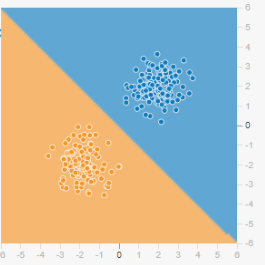
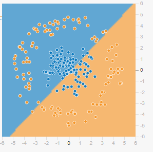
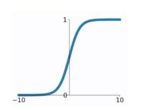
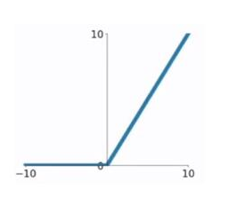
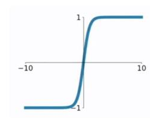
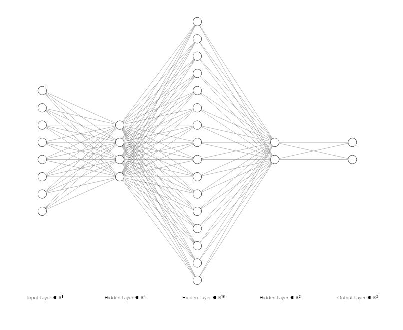

##   神经网络基础

#### 一、线性模型
输入$x_i$，输出y满足
$$ y=\sum_{i} w_i x_i+b $$
其中$w_i,b \in R$是模型参数

**线性可分**

**线性不可分**

#### 二、激活函数去线性化 
Tensorflow 提供了7种不同的激活函数，`tf.nn.relu`,`tf.sigmoid`,`tf.tanh`是最常用的几个
###### 2.1 sigmoid函数
$$f(x)=\frac{1}{1+e^{-x}}$$
函数将取值$(-\infty,\infty)$的数映射到$(0,1)$的数,图形如下：

###### 2.2 relu函数
$$f(x)=\max (0,x)$$

###### 2.3 tanh函数
$$f(x)=\frac{1-e^{-2x}}{1+e^{-2x}}$$
函数将取值$(-\infty,\infty)$的数映射到$(-1,1)$的数,图形如下：

**总结**：sigmoid函数可用于逻辑回归问题，一般在网络最后一层使用，作为输出层进行二分类，尽量不要使用在隐藏层。tanh函数和sigmoid函数当自变量很大或很小时，$ f^{\prime}(x) $接近于0，会导致梯度很小，权重更新非常缓慢，即梯度消失问题。relu函数当输入为负时，梯度为0，会产生梯度消失问题。

**参考**：https://www.cnblogs.com/lliuye/p/9486500.html

**神经网络一般结构**

#### 三、损失函数
###### 3.1 二分类问题
定义单个输出节点的神经网络。控制输出值大小取$(0,1)$之间。0.5作为阈值，当结点输出接近0(小于0.5)时判定为0，当结点输出接近1(大于于0.5)时判定为1。
###### 3.2 多分类问题
最常用方法设置n个输出节点，n为类别的个数。如果一个样本属于类别k，那么这个类别对应的输出节点应该取值为1，其它节点为0。以mnist手写字体识别为例，是一个10分类问题。如果样本对应1，那么输出结果要尽可能接近[0,1,0,0,0,0,0,0,0,0]。判断输出向量和期望向量的接近程度一般使用交叉熵(cross entroy)。刻画的是两个概率分布之间的距离。

假设p,q是两个概率分布。交叉熵$H(p,q):=-\sum_{x} p(x) \log{q(x)}$

下面考虑如何将神经网络前向传播结果转化为概率分布。

**Softmax回归**

假设原始的神经网络输出为$y_1,y_2,...,y_n$,经过Softmax回归的输出为：
$$ Softmax(y)_i=y_i^{\prime}= \frac {e^{y_i}}{\sum_{i=1}^{n} e^{y_i}} $$
example:假设有一个三分类问题，某个样例正确答案是$(1,0,0)$，某模型经过Softmax回归后的预测答案是$(0.5,0.4,0.1)$，那么预测距离和正确答案之间的交叉熵为：
$$ H((1,0,0)(0.5,0.4,0.1))=-(1 \times  \log{0.5}+0 \times \log{0.4}+0 \times \log{0.1}) \approx 0.3$$

**tensorflow中交叉熵使用：**

- `tf.nn.softmax_cross_entropy_with_logits(labels=y_,logits=y)`

    labels: Each vector along the class dimension should hold a valid probability distribution
    logits: Per-label activations, typically a linear output. These activation energies are interpreted as unnormalized log probabilities.

- `tf.nn.sparse_softmax_cross_entropy_with_logits(labels=y_,logits=y)`

    labels: Tensor of shape [d_0, d_1, ..., d_{r-1}] (where r is rank of labels and result) and dtype int32 or int64. Each entry in labels must be an index in [0, num_classes). Other values will raise an exception when this op is run on CPU, and return NaN for corresponding loss and gradient rows on GPU.
    logits: Per-label activations (typically a linear output) of shape [d_0, d_1, ..., d_{r-1}, num_classes] and dtype float16, float32, or float64. These activation energies are interpreted as unnormalized log probabilities.
    
###### 3.3 回归问题
最常用的损失函数是均方误差(MSE.mean squared error)
$$ mse(y,y^{\prime})=\frac {\sum_{i=1}^{n}(y_i-y_i^{\prime})^2}{n} $$

**tensorflow实现**：
`mse=tf.reduce_mean(tf.square(y_-y))`

#### 四、神经网络优化算法
###### 4.1 Batch gradient descent
we need to calculate the gradients for the whole dataset to perform just one update, batch gradient descent can be very slow and is intractable for datasets that do not fit in memory

缺点：数据量较大时非常耗时
###### 4.2 随机梯度下降法(SGD，Stochastic Gradient Decent )
在每一轮迭代中，随机优化某一条训练数据集上的损失函数

缺点：甚至无法达到局部最优
###### 4.3 Mini-batch gradient descent
Mini-batch gradient descent finally takes the best of both worlds and performs an update for every mini-batch of n training examples

**参考文献：** An overview of gradient descent optimization algorithms

#### 五、神经网络进一步优化
###### 5.1 学习率设置
学习率既不能过大，也不能过小

**tensorflow指数衰减法：**
`learning_rate=tf.train.exponential_decay()`
###### 5.2 过拟合问题
**正则化**

假设损失函数是$J(\theta)$，正则化考虑优化时不是直接优化$J(\theta)$，而是优化$J(\theta)+ \lambda R(w)$。

其中$R(w)$刻画的是模型的复杂程度，

$L1$正则化：$R(w)=\| w \|_1=\sum_i  |{w_i}|$；

$L2$正则化：$R(w)=\| w \|_2^2=\sum_i  |{w_i}|$

