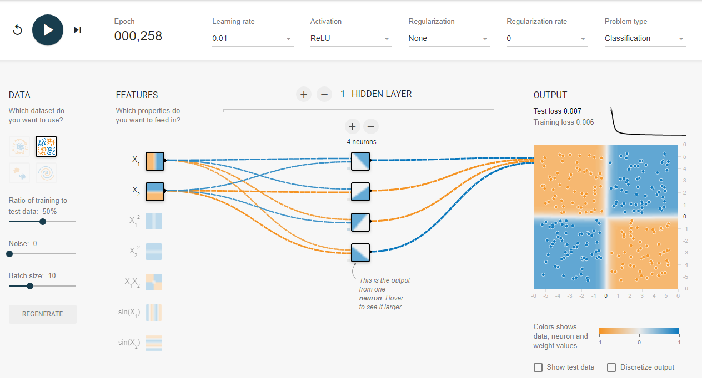

# XOR
**异或，英文为exclusive OR，缩写成xor。异或（xor）是一个数学运算符**
## 1、感知机模型
感知机模型可以简单的理解为单层的神经网络。感知机接收多个输入信号，输出一个信号。下图展示了一个简单的两个输入信号的感知机模型


## 2、异或运算
异或操作直观来说就是如果两个输入的符号相同时（同为正或者同为负）则输出0，否则（一个正一个负）输出为1。

数学逻辑语言可以表示为：$a \oplus b=(\neg a \land b)\lor(a \land \neg b)$

其中$\oplus$表示异或算子，$\neg$表示非（逆）运算，即当$a=1$时，$\neg a=0$；而$a=0$时，$\neg a=1$。$\land$和$\lor$分别表示求交集和并集运算。

然而，值的注意的是，感知机是无法模拟异或运算的。这在1969被证明，具体可以了解书籍 Perceptrons:An Introduction to Computational Geometry

以下我们基于tensorflow说明这一事实，另外再加入了隐藏层之后，异或运算可以实现模拟。

## 3、基于tf的Perception模型和单隐藏层nn实现

#### 3.1、Perception 模型


```python
import tensorflow as tf
import numpy as np
# init data
x_data=np.array([[1,1],[1,0],[0,1],[0,0]],dtype=np.int)
y_data=np.array([[0],[1],[1],[0]],dtype=np.int)

# define tf placeholder
x=tf.placeholder(tf.float32,[None,2],name='x-input')
y=tf.placeholder(tf.float32,[None,1],name='y-input')

# define parameters
w=tf.Variable(tf.random_normal([2,1]))
b=tf.Variable([0.1])

# model init
out=tf.nn.relu(tf.matmul(x,w)+b)

loss=tf.reduce_mean(tf.square(y-out))# 含隐藏层的网络

opt=tf.train.AdamOptimizer(0.01).minimize(loss)
init=tf.global_variables_initializer()
fd={x:x_data,y:y_data}
sess=tf.Session()
sess.run(init)
for i in range(2000):
    _,per_loss=sess.run([opt,loss],feed_dict=fd)
    if (i%10)==0:# 10次输出一下结果
        print('step{},nn loss is:{}'.format(i,per_loss))
```

#### 3.2、单隐藏层的nn模型


```python
import tensorflow as tf
import numpy as np
# init data
x_data=np.array([[1,1],[1,0],[0,1],[0,0]],dtype=np.int)
y_data=np.array([[0],[1],[1],[0]],dtype=np.int)

# define tf placeholder
x=tf.placeholder(tf.float32,[None,2],name='x-input')
y=tf.placeholder(tf.float32,[None,1],name='y-input')

# define parameters
w1=tf.Variable(tf.random_normal([2,2]))
w2=tf.Variable(tf.random_normal([2,1]))
b1=tf.Variable([0.1,0.1])
b2=tf.Variable([0.1])

# model init
out1=tf.nn.relu(tf.matmul(x,w1)+b1)
out2=tf.matmul(out1,w2)+b2


loss=tf.reduce_mean(tf.square(y-out2))# 含隐藏层的网络


opt=tf.train.AdamOptimizer(0.01).minimize(loss)
init=tf.global_variables_initializer()
fd={x:x_data,y:y_data}
sess=tf.Session()
sess.run(init)
for i in range(2000):
    _,nn_loss=sess.run([opt,loss],feed_dict=fd)
    if (i%10)==0:# 10次输出一下结果
        print('step{},nn loss is:{}'.format(i,nn_loss))
```

**再附上tensorflow playground的结果：**


**明显看到，当没有隐藏层使用感知机来模拟异或操作效果比较差，损失函数取值表较大。**

**使用含隐藏层的神经网络模型在合适的参数之下能很好的拟合异或操作，损失函数在很短时间之内接近0**
