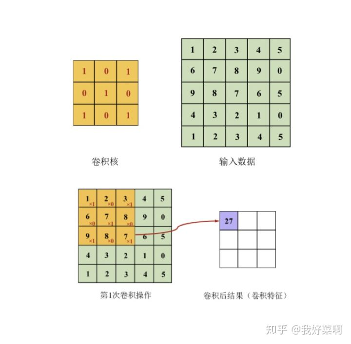
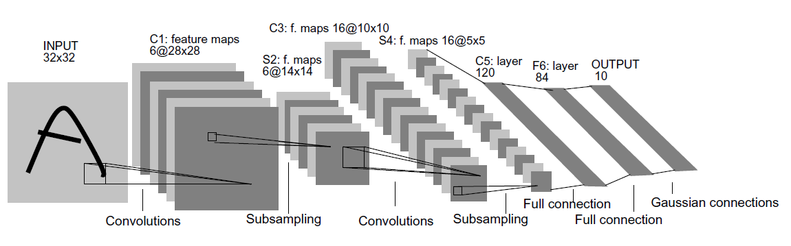
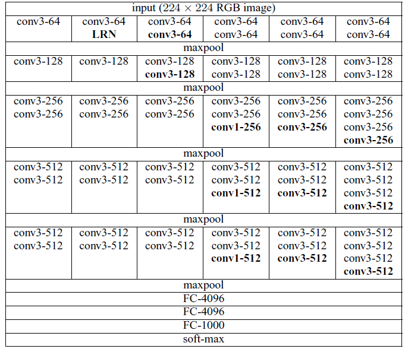
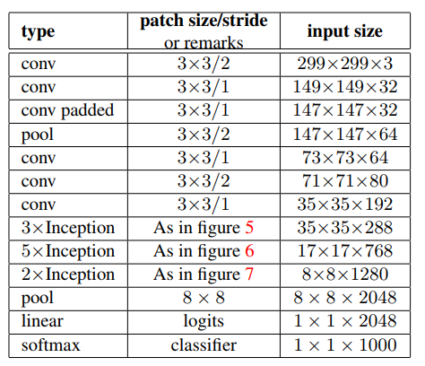

## 一、卷积神经网络
卷积神经网络是在全连接神经网络基础上提出的。全连接神经网络相邻两层之间所有节点都有边连接，而对于卷积神经网络，相邻两层之间只有部分节点连接，为了展示每一层的神经元维度，一般会将每一个卷积层的节点组织成一个三维矩阵。

使用全连接神经网络的最大问题在于参数过多。试想对于一个像素值28x28x1的图片，假设第一个隐藏层节点数为100，那么这个网络在第一层上会有28x28x100+100个参数。参数增多会导致计算速度减慢，还容易导致过拟合问题。卷积神经网络能够有效的避免这一问题。

### 1.1 网络结构

一个卷积神经网络主要由四种结构组成：

**（1）输入层**

三维矩阵代表一张图片。长和宽代表了图像的大小。第三个维度代表深度，指的是图像的色彩通道。比如黑白图片深度是1，RGB色彩模式下，图像深度是3。

**（2）卷积层**

卷积本质上就是矩阵和矩阵之间的对应元素相乘，再加结果求和的过程，二维情况可以参考下图，三维情况类似，如果输入数据深度为3，对应的卷积核深度也为3，仍然是对应位置的元素相加再求和。对于卷积操作，需要选择的是卷积核大小（kernel size）、卷积步长（stride）、填充（padding，通常填充0）经过卷积操作后的特征图尺寸（F表示输入大小，K表示卷积核大小，P表示填充，S表示步长，⌊⌋表示向下取整）：$ (F-K+2 \times P)/S+1 $

**tensorflow实现：**
    
[tf.nn.conv2d(input,filter=filter_weight,strides=[1,1,1,1],padding='SAME')](https://tensorflow.google.cn/api_docs/python/tf/nn/conv2d?hl=en)

**（3）池化层**

池化，又可以称作汇合，英文pooling，本质是一种降采样，具有特征不变性、特征降维、防止过拟合等作用，一般是均值池化（average pooling）和最大池化（max pooling）。对于均值池化，池化操作的核大小区域内的值平均后，代替原区域，如2x2的区域内有 2，1，3，6，均值池化后该区域就变成只有一个值3；对于最大值池化，则是选取池化操作的核大小区域内的最大值，代替原区域，上述例子中结果为6

**tensorflow实现：**
    
[tf.nn.max_pool2d(input,ksize,strides,padding)](https://tensorflow.google.cn/api_docs/python/tf/nn/max_pool2d?hl=en)

**（4）全连接层**

在经过多次卷积和池化操作之后，在卷积神经网络的最后一般会是1到2个全连接层来给出最后分类结果。

### 1.2 经典模型
##### 1.2.1 LeNet-5模型
LeNet-5模型是Yann LeCun 于1998年在论文[gradient-based learning applied to document recognition](http://yann.lecun.com/exdb/publis/pdf/lecun-01a.pdf)中提出的，在MNIST数据集上可以达到99.2%的正确率。LeNet-5模型共有7层，下图展示了LeNet-5模型的架构

##### 1.2.2 VGGNet 模型
**文章:**[Very deep convolutional networks for large-scale image recognition](https://arxiv.org/abs/1409.1556)

##### 1.2.3 Inception-v3模型
**文章:**[Rethinking the inception architecture for computer vision](https://www.cv-foundation.org/openaccess/content_cvpr_2016/papers/Szegedy_Rethinking_the_Inception_CVPR_2016_paper.pdf)

