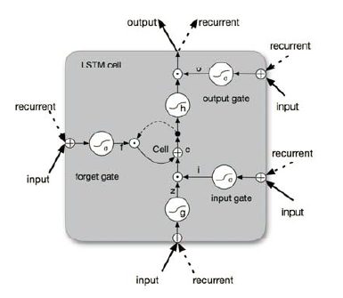
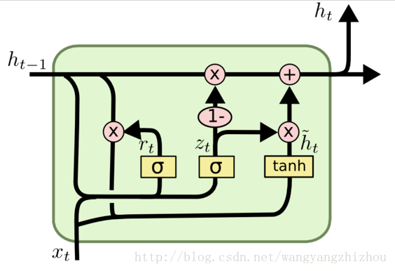
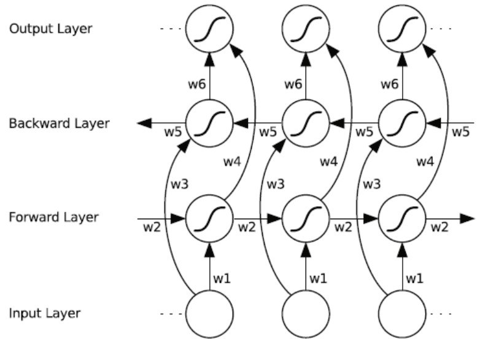
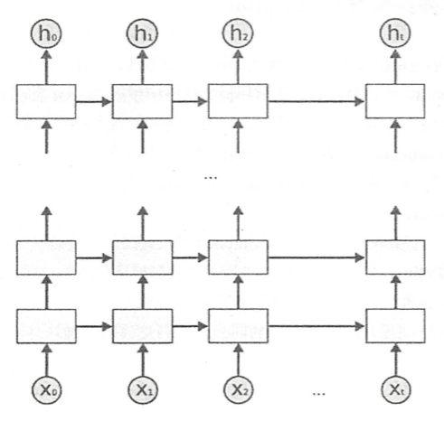

## Task5 循环和递归神经网络
循环神经网络的主要用途是处理和预测序列数据。

对于一个序列数据，可以将这个序列上不同时刻的数据依次传入循环神经网络的输入层，而输出可以是对序列中下一个时刻的预测，也可以是对当前时刻信息的处理结果（比如语音识别结果）。

#### 1、一般RNN的结构
我们从基础的神经网络中知道，神经网络包含输入层、隐层、输出层，通过激活函数控制输出，层与层之间通过权值连接。激活函数是事先确定好的，那么神经网络模型通过训练“学“到的东西就蕴含在“权值“中。

基础的神经网络只在层与层之间建立了权连接，RNN最大的不同之处就是在层之间的神经元之间也建立的权连接。如图。

这是一个标准的RNN结构图，图中每个箭头代表做一次变换，也就是说箭头连接带有权值。左侧是折叠起来的样子，右侧是展开的样子，左侧中h旁边的箭头代表此结构中的“循环“体现在隐层。

在展开结构中我们可以观察到，在标准的RNN结构中，隐层的神经元之间也是带有权值的。也就是说，随着序列的不断推进，前面的隐层将会影响后面的隐层。图中o代表输出，y代表样本给出的确定值，L代表损失函数，我们可以看到，“损失“也是随着序列的推荐而不断积累的。

除上述特点之外，标准RNN的还有以下特点：

1、权值共享，图中的W全是相同的，U和V也一样。

2、每一个输入值都只与它本身的那条路线建立权连接，不会和别的神经元连接。

#### 2、LSTM
下面来了解一下LSTM（long short-term memory）。长短期记忆网络是RNN的一种变体，RNN由于梯度消失的原因只能有短期记忆，LSTM网络通过精妙的门控制将短期记忆与长期记忆结合起来，并且一定程度上解决了梯度消失的问题。

LSTM是一种拥有三个“门”的特殊网络结构，包括遗忘门、输入门、输出门。所谓“门”结构就是一个使用sigmoid神经网络和一个按位做乘法的操作，这两个操作合在一起就是一个“门”结构。

[1]“遗忘门”的作用是让循环神经网络“忘记”之前没有用的信息。

[2]循环神经网络“忘记”了部分之前的状态后，还需要从当前的输入补充最新的记忆。这个过程就是“输入门”完成的。

[3]LSTM结构在计算得到新状态后需要产生当前时刻的输出，这个过程是由“输出门”完成的。

*TensorFlow中可以通过*
>[tf.nn.rnn_cell.BasicLSTMCell()](https://tensorflow.google.cn/api_docs/python/tf/nn/rnn_cell/BasicLSTMCell?hl=en)
来实现BILSTM

#### 3、GRU结构
GRU是LSTM网络的一种效果很好的变体，它较LSTM网络的结构更加简单，而且效果也很好，因此也是当前非常流形的一种网络。GRU既然是LSTM的变体，因此也是可以解决RNN网络中的长依赖问题。

在LSTM中引入了三个门函数：输入门、遗忘门和输出门来控制输入值、记忆值和输出值。而在GRU模型中只有两个门：分别是更新门和重置门。具体结构如下图所示：

*TensorFlow中可以通过*
>[tf.nn.rnn_cell.GRUCell()](https://tensorflow.google.cn/api_docs/python/tf/nn/rnn_cell/GRUCell?hl=en)
来实现BILSTM

#### 4、BILSTM
如果能像访问过去的上下文信息一样，访问未来的上下文，这样对于许多序列标注任务是非常有益的。例如，在最特殊字符分类的时候，如果能像知道这个字母之前的字母一样，知道将要来的字母，这将非常有帮助。

双向循环神经网络（BRNN）的基本思想是提出每一个训练序列向前和向后分别是两个循环神经网络（RNN），而且这两个都连接着一个输出层。这个结构提供给输出层输入序列中每一个点的完整的过去和未来的上下文信息。下图展示的是一个沿着时间展开的双向循环神经网络。六个独特的权值在每一个时步被重复的利用，六个权值分别对应：输入到向前和向后隐含层（w1, w3），隐含层到隐含层自己（w2, w5），向前和向后隐含层到输出层（w4, w6）。值得注意的是：向前和向后隐含层之间没有信息流，这保证了展开图是非循环的。

*TensorFlow中可以通过*
>[tf.nn.rnn_cell.BasicLSTMCell()](https://tensorflow.google.cn/api_docs/python/tf/nn/rnn_cell/BasicLSTMCell?hl=en)
来实现BILSTM

#### 5、深层循环神经网络（DRNN）

*TensorFlow中可以通过*
>[tf.rnn_cell.MultiRNNCell(lstm * number_of_layer)](https://tensorflow.google.cn/api_docs/python/tf/nn/rnn_cell/MultiRNNCell?hl=en)来构建DRNN，其中number_of_layer表示了有多少层

>[tf.nn.rnn_cell.DropoutWrapper](https://tensorflow.google.cn/api_docs/python/tf/nn/rnn_cell/DropoutWrapper?hl=en)
来实现dropout功能

在我们构建自己的任务模型时，往往会设置dropout来让构建的网络模型更加健壮，类似在卷积神经网络只在最后全连接层使用dropout，DRNN一般只在不同层循环体结构中使用dropout，而不在同一层的循环体结构中使用。即从时刻t-1传递到t时刻时，RNN不进行状态的dropout，但在同一时刻t中，不同层循环体之间会使用dropout。

**参考资料：** 

[1][双向长短时记忆循环神经网络详解](https://blog.csdn.net/jojozhangju/article/details/51982254)

[2][LSTM神经网络输入输出究竟是怎样的？](https://www.zhihu.com/question/41949741)

[3][深度学习之GRU网络](https://www.cnblogs.com/jiangxinyang/p/9376021.html)
